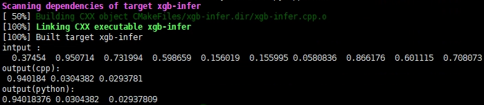

# XGBoost-py2cpp

将基于python训练得到XGBoost模型，用于C++环境推理的示例Demo

所需的头文件、库文件已经包含在当前目录下

环境：Ubuntu, xgboost == 1.7.4

1. 在当前目录下，使用python获得训练模型 "checkpoint.model"
```python
python xgb-train.py
```
2. 编译链接运行推理cpp文件，对 "checkpoint.model"文件进行推理
```shell
bash xgb-infer.sh
```

运行结果如图：


本内容拓展自：https://github.com/EmbolismSoil/xgboostpp